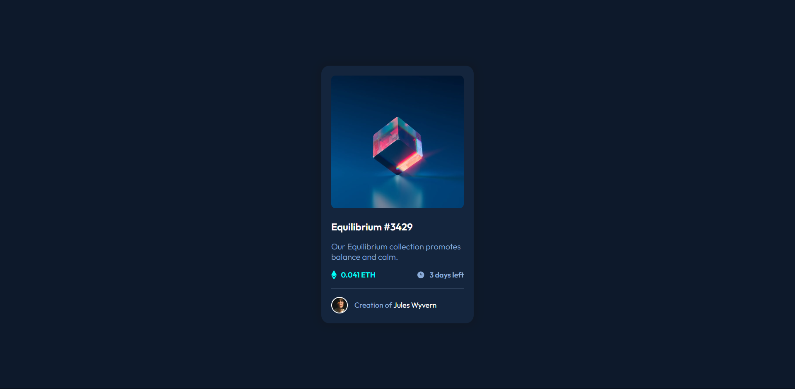

# Frontend Mentor - NFT preview card component

Esta es una solución al [desafío del componente de código QR en Frontend Mentor](https://www.frontendmentor.io/challenges/nft-preview-card-component-SbdUL_w0U/hub). Los desafíos de Frontend Mentor lo ayudan a mejorar sus habilidades de codificación mediante la creación de proyectos realistas.

- Solution URL: [Github](https://github.com/ayrtonbolwal/fm-preview-card-component)
- Live Site URL: [Netifly](https://ayrtonbolwal-preview-card-component.netlify.app/)

## Mi Proceso

- Semántica de HTML5
- Variables en CSS
- Técnicas de Flexbox
- Convención BEM

## Cosas que aprendí

- El manejo y dimensionamiento de bordes
- Convención BEM
- Uso de position relative y absolute

## Recursos

- [Conveción BEM](https://www.freecodecamp.org/espanol/news/convenciones-de-nomenclatura-de-css-que-te-ahorraran-horas-de-depuracion/)
- [Position absolute](https://developer.mozilla.org/en-US/docs/Web/CSS/position)

Happy Coding! 👾🖖
